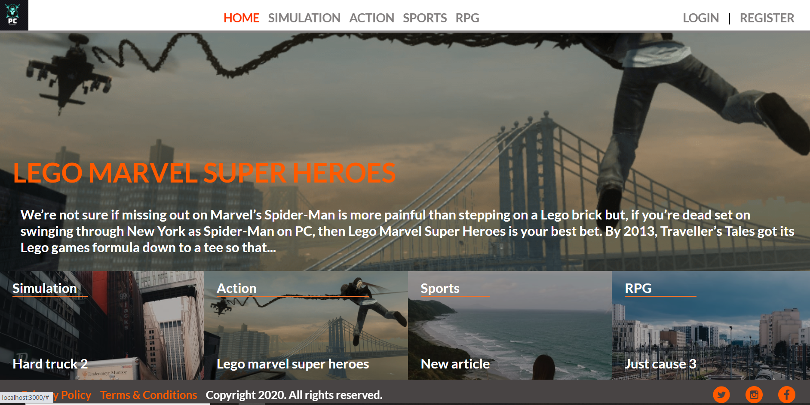

#  Article project

Ruby on Rails Microverse Capstone Project By Abhigyan Mahanta.

## Usage

This project has the basic features of the article posting websites.


## Live Demo

[Live Demo Link](https://gamearticles.herokuapp.com/)

# What it does

- This is an Article creation website.
- Registered users can add articles to this website and vote for any article.
- In the homepage of the project, user can see the most popular article (according to votes).
- User can also see the most recent article for each category.
- User can click on the category link in navbar to see all the articles of that category in the category page.
- On the category page, user can click on article to see the full content of the article.
- If the user is not logged he/she can see the articles but not create one or vote.
- User can vote only one time for each article.
- Users and articles have many votes.
- A vote belongs to a user and an article.
- An article can have many categories, and a category can have many articles.
- ArticleCategory model for the "many to many" relationship between articles and categories.
- User can choose not to upload an image during article creation. A randomly generated image will take the place.

## Build-With

- Ruby -v 2.6.6
- Rails -v 5.2.4.4
- Postgresql
- VScode

## Getting Started

### Prerequisites

To get this project up and running locally, you must already have ruby and necessary gems installed on your computer

**To get this project set up on your local machine, follow these simple steps:**

1. Open Terminal.
2. Navigate to your desired location to download the contents of this repository.
3. Copy and paste the following code into the Terminal: git clone https://github.com/Abhigyan001/games_info/tree/feature
4. Run ```cd games_info```.
5. Run ```bundle install``` to get the necesary gems.
6. Run `rails db:create`.
6. Run `rails db:migrate`.
7. Run `rails db:seed`.
8. Run `rails server`


## Author Details::

👤 ABHIGYAN Mahanta

- Github: [@Abhigyan001](https://github.com/Abhigyan001)
- Twitter: [@abhigyan_001](https://twitter.com/abhigyan_001)
- LinkedIn: [Abhigyan](https://www.linkedin.com/in/abhigyan-mahanta-b49799145/)

## Show your support

Give ⭐ Star me on GitHub — it helps!

## 📝 License

This project is [MIT](lic.url) licensed.   


